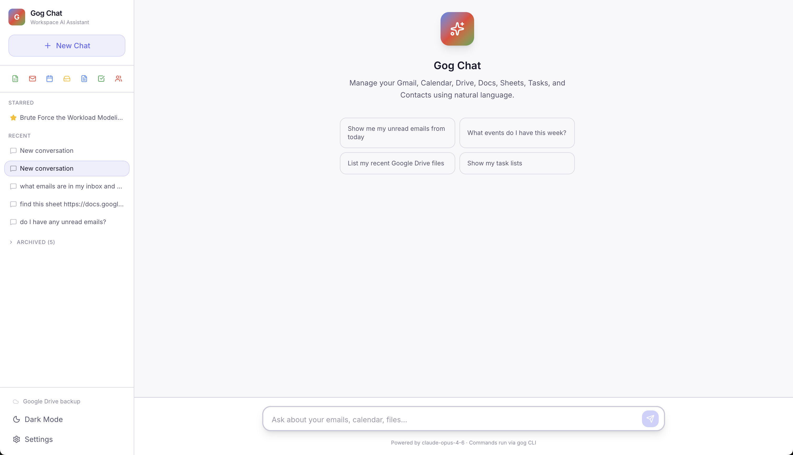
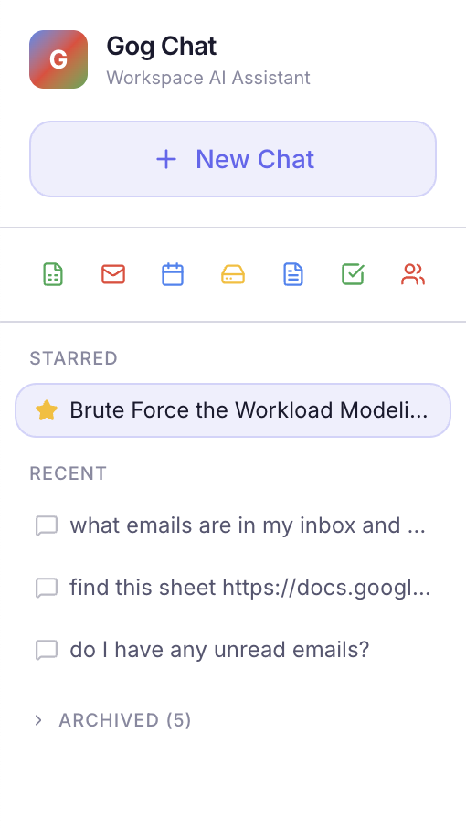
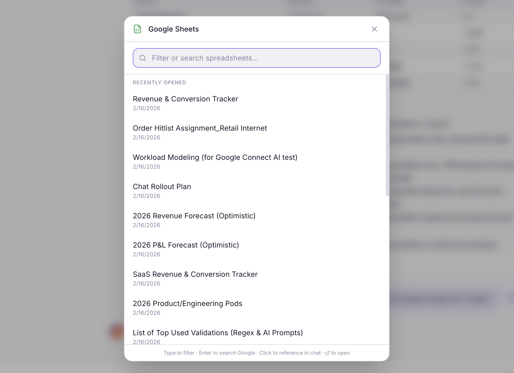
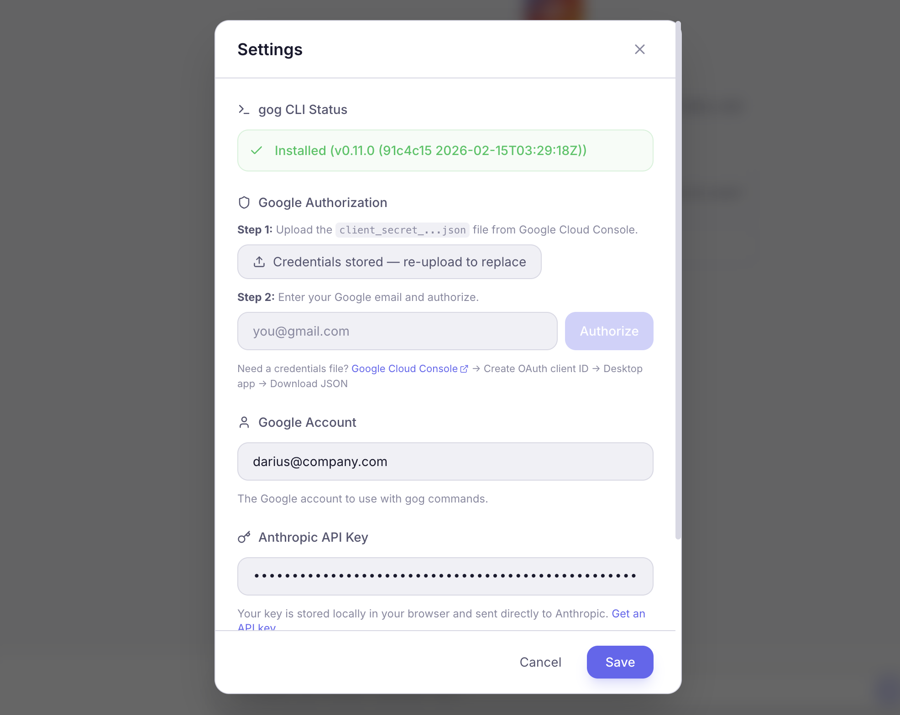
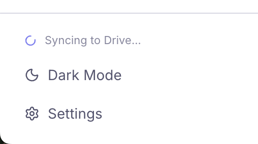
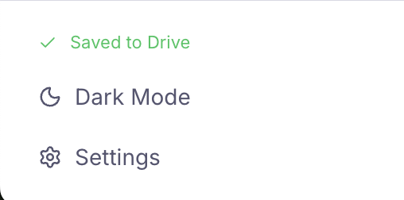

# Gog Chat

**Your Google Workspace, one screen away.**

Gog Chat is a **locally-run** AI-powered dashboard and chat assistant for Gmail, Calendar, Drive, Sheets, Docs, Tasks, and Contacts. It shows you what matters each morning, helps you draft replies, tracks follow-ups, and lets you talk to your Google Workspace in plain English.

Runs on your machine. Your credentials and API keys never leave your computer. Built with [Next.js](https://nextjs.org), [Claude](https://anthropic.com), and the [gog CLI](https://github.com/steipete/gogcli).

<p align="center">
  
</p>
<p align="center"><em>The dashboard — your inbox, calendar, recent files, follow-ups, drafts, and routines in one view.</em></p>

---

## What It Does

### Dashboard

When you open Gog Chat, you land on a single scrollable dashboard with everything you need:

| Section | What it shows |
|---------|--------------|
| **Daily Briefing** | Your inbox, today's calendar events (with durations), and recently opened files — each linking out to the real thing in Gmail, Calendar, or Drive |
| **Follow-up Tracker** | AI-scanned email threads that need your attention — filtered to real conversations, not automated noise |
| **Email Drafts** | Important unread emails that need a reply, with AI-generated drafts that match your writing style |
| **Routines** | Custom instructions you set to run on a schedule or as a one-off in the future |
| **Activity Recap** | AI-summarized view of what you did this week or any past week/month — emails sent, files worked on, meetings attended |

The sidebar lets you jump to any section, search across conversations and Google services, or open a chat.

### Chat

Click **+ New Chat** or select a conversation to switch to the full chat interface. Talk to Claude and it executes `gog` commands on your behalf:

| Service | What you can do |
|---------|----------------|
| **Gmail** | Search, read, send, reply, manage labels & drafts |
| **Calendar** | List, create, update, delete events; check availability |
| **Drive** | Browse, search, upload, download files; manage sharing |
| **Sheets** | Read & write cells, export to PDF/CSV/XLSX |
| **Docs** | Export documents to PDF, DOCX, etc. |
| **Slides** | Export presentations to PPTX, PDF |
| **Tasks** | Add, complete, delete tasks across lists |
| **Contacts** | Search, create, update contacts |

### Highlights

- **Dashboard-first** — see your inbox, calendar, follow-ups, and drafts without typing anything
- **AI-filtered email drafts** — the LLM decides which emails actually need a reply, learns your writing style from your sent emails, and generates drafts that sound like you
- **Follow-up tracking** — AI scans your inbox for important threads from real people that need attention, filtering out automated messages
- **Activity recaps** — pick any week or month and get an AI-generated summary of what you accomplished
- **Scheduled routines** — set up repeating or one-time AI tasks (e.g. "summarize my unread emails every morning")
- **Conversational chat** — describe what you need in natural language and watch it happen in real time
- **Unified search** — search your conversations and Google services from one input in the sidebar
- **Quick-search panel** — click any service icon to browse your 20 most recently opened items, filter, and search
- **Conversation management** — star, rename, archive, and restore chats; empty conversations auto-clean
- **Google Drive sync** — conversations are backed up to a `GogChat` folder in your Drive
- **Light & dark mode** — toggle from the sidebar
- **Configurable models** — defaults to Claude Opus 4.6, supports all Claude models + custom model IDs
- **Fully local** — your API key is stored in your browser and sent only to Anthropic's API

<p align="center">
  
</p>
<p align="center"><em>Sidebar with dashboard navigation, unified search, starred conversations, and Drive sync status.</em></p>

<p align="center">
  
</p>
<p align="center"><em>Quick-search panel for browsing and searching your Google Sheets.</em></p>

---

## Prerequisites

> **Note:** Gog Chat is a local application — you run it on your own machine at `localhost:3000`. The gog CLI executes locally to access Google's APIs, so your Google credentials and Anthropic API key stay entirely on your computer.

Before you start, you'll need three things:

1. **Node.js 18+** — [Download here](https://nodejs.org)
2. **gog CLI** — the bridge between the app and Google's APIs
3. **An Anthropic API key** — for Claude ([Get one here](https://console.anthropic.com))

---

## Setup

### Step 1 — Install the gog CLI

```bash
brew install steipete/tap/gogcli
```

> No Homebrew? See the [gog CLI repo](https://github.com/steipete/gogcli) for other install methods.

Verify it's installed:

```bash
gog --version
```

### Step 2 — Create a Google Cloud project & OAuth credentials

This gives gog permission to access your Google Workspace on your behalf. It takes about 5 minutes.

#### 2a. Create a project

1. Go to the [Google Cloud Console](https://console.cloud.google.com)
2. Click the project dropdown at the top → **New Project**
3. Name it something like `Gog Chat` → **Create**
4. Make sure your new project is selected in the dropdown

#### 2b. Enable the APIs

Go to **APIs & Services → Library** and enable each of these (click into each one and hit **Enable**):

- [Gmail API](https://console.cloud.google.com/apis/library/gmail.googleapis.com)
- [Google Calendar API](https://console.cloud.google.com/apis/library/calendar-json.googleapis.com)
- [Google Drive API](https://console.cloud.google.com/apis/library/drive.googleapis.com)
- [Google Sheets API](https://console.cloud.google.com/apis/library/sheets.googleapis.com)
- [Google Docs API](https://console.cloud.google.com/apis/library/docs.googleapis.com)
- [Google Slides API](https://console.cloud.google.com/apis/library/slides.googleapis.com)
- [Google Tasks API](https://console.cloud.google.com/apis/library/tasks.googleapis.com)
- [People API](https://console.cloud.google.com/apis/library/people.googleapis.com) (for Contacts)

> **Tip:** You can paste each link directly into your browser while your project is selected — it'll take you right to the enable page.

#### 2c. Configure the OAuth consent screen

1. Go to **APIs & Services → OAuth consent screen**
2. Choose **External** → **Create**
3. Fill in:
   - **App name:** `Gog Chat` (or anything you like)
   - **User support email:** your email
   - **Developer contact email:** your email
4. Click **Save and Continue** through the remaining steps
5. Under **Test users**, add your Google email address

#### 2d. Create OAuth credentials

1. Go to **APIs & Services → Credentials**
2. Click **+ Create Credentials → OAuth client ID**
3. Application type: **Desktop app**
4. Name: `Gog Chat` (or anything)
5. Click **Create**
6. **Download the JSON file** — you'll need it in the next step

### Step 3 — Clone and run Gog Chat

```bash
git clone https://github.com/dsalehipour/Gog-Chat.git
cd Gog-Chat
npm install
npm run dev
```

Open [http://localhost:3000](http://localhost:3000) in your browser.

### Step 4 — Connect your Google account (in-app)

1. Click the **gear icon** in the sidebar to open Settings
2. Under **Google Authorization**, click **Upload credentials JSON** and select the `client_secret_...json` file you downloaded in Step 2d
3. Click **Authorize** — this opens a browser tab where you sign into Google and grant permissions
4. Once authorized, your Google account will appear in Settings automatically

> **Prefer the terminal?** You can also run these commands manually:
> ```bash
> gog auth credentials ~/Downloads/client_secret_....json
> gog auth add your@email.com
> ```

### Step 5 — Add your Anthropic API key

1. Still in Settings, paste your **Anthropic API key**
2. (Optional) Choose a different Claude model
3. Start chatting!

<p align="center">
  
</p>
<p align="center"><em>Settings panel — configure your Google account, API key, and Claude model. The gog CLI status is detected automatically.</em></p>

---

## Usage Examples

### Chat

Here are some things you can say:

| Try saying... | What happens |
|--------------|-------------|
| "Show me my unread emails from today" | Searches Gmail and displays results |
| "Schedule a meeting with Alex tomorrow at 2pm" | Creates a Calendar event |
| "What's in my Q4 Budget spreadsheet?" | Reads the sheet and summarizes it |
| "Update cell D5 in that sheet to 42000" | Writes directly to Sheets |
| "Find all PDFs in my Drive from last month" | Searches Drive with filters |
| "Add 'Buy groceries' to my tasks" | Creates a new Google Task |
| "Send a reply to that email saying I'll be there" | Drafts and sends via Gmail |

### Dashboard features

- **Briefing** — opens automatically on launch. Each item links directly to Gmail, Calendar, or Drive. Archive emails with the hover button.
- **Follow-ups** — hit refresh to scan your inbox. The AI focuses on real conversations (sales, partnerships, colleagues) and ignores automated messages.
- **Drafts** — shows important unread emails that need a reply. Click "Generate Draft" to get a reply that matches your writing style. Expand "Your Writing Style" to review or edit what the AI learned.
- **Routines** — add instructions like "Summarize my unread emails" with a schedule (daily, weekly, or one-time). They run automatically or on demand.
- **Recap** — pick a timeframe (this week, last month, custom range) and get an AI-generated summary of your activity.

### Quick-search panel

Click any service icon in the sidebar (Sheets, Gmail, Calendar, etc.) to open the quick-search panel:

- **Browse** your 20 most recently opened items
- **Type to filter** the loaded results instantly
- **Press Enter** to do a full Google search across that service
- **Click an item** to start a new chat referencing it

### Unified search

The search bar in the sidebar searches two things at once:

- **Your conversations** — type to filter, use arrow keys to navigate, press Enter to open
- **Google services** — press Enter with no conversation match to search across Gmail, Drive, Calendar, and more

---

## Project Structure

```
Gog-Chat/
├── src/
│   ├── app/
│   │   ├── page.tsx              # Main app — state, conversations, routing
│   │   ├── layout.tsx            # Root layout + metadata
│   │   ├── globals.css           # Theme variables + Tailwind
│   │   └── api/
│   │       ├── chat/route.ts     # Claude streaming + gog tool execution
│   │       ├── status/route.ts   # gog CLI health check
│   │       ├── services/route.ts # Quick-search: recent items + search
│   │       ├── briefing/route.ts # Daily briefing: inbox, calendar, files
│   │       ├── recap/route.ts    # AI-generated activity recaps
│   │       ├── followups/route.ts # AI-scanned follow-up suggestions
│   │       ├── drafts/route.ts   # Email draft generation + style analysis
│   │       ├── auth/route.ts     # In-app Google OAuth flow
│   │       └── conversations/
│   │           ├── backup/route.ts  # Local file backup
│   │           └── sync/route.ts    # Google Drive sync
│   ├── components/
│   │   ├── DashboardView.tsx     # Dashboard — briefing, follow-ups, drafts, routines, recap
│   │   ├── ChatInterface.tsx     # Chat area + input + conversation controls
│   │   ├── MessageBubble.tsx     # Message rendering + markdown
│   │   ├── Sidebar.tsx           # Navigation, search, conversation list
│   │   ├── ServicePanel.tsx      # Quick-search modal per service
│   │   ├── UnifiedSearchPanel.tsx # Cross-service search modal
│   │   └── SettingsPanel.tsx     # API key, model, advanced config
│   └── lib/
│       ├── gog.ts                # gog CLI wrapper (execFile)
│       ├── tools.ts              # Claude tool definitions + system prompt
│       ├── types.ts              # TypeScript interfaces
│       ├── drive-sync.ts         # Drive upload/download/merge logic
│       └── scheduler.ts          # Routine scheduling utilities
├── public/                       # Favicons
├── package.json
├── tsconfig.json
└── next.config.ts
```

---

## How It Works

1. You type a message in the chat
2. The message + conversation history is sent to Claude via the Anthropic API
3. Claude decides which `gog` CLI commands to run (if any) using [tool use](https://docs.anthropic.com/en/docs/build-with-claude/tool-use)
4. The server executes each `gog` command securely via `child_process.execFile`
5. Results stream back to Claude, which can run more commands or compose a final response
6. Everything streams to the browser in real time via Server-Sent Events

Dashboard features (briefing, follow-ups, drafts, recaps) work similarly — each has a dedicated API route that runs `gog` commands to fetch data from Google, then uses the LLM to filter, classify, or summarize the results.

Conversations are saved to `localStorage`, backed up to a local file on the server, and synced to a `GogChat` folder in your Google Drive.

<p align="center">
  
  &nbsp;&nbsp;&nbsp;&nbsp;
  
</p>
<p align="center"><em>The sidebar shows real-time sync status — syncing in progress (left) and successfully saved (right).</em></p>

---

## Configuration

All settings are accessible from the gear icon in the sidebar:

| Setting | Default | Description |
|---------|---------|-------------|
| **API Key** | — | Your Anthropic API key (required) |
| **Model** | `claude-opus-4-6` | Which Claude model to use |
| **gog Account** | Auto-detected | Which Google account gog uses |
| **Custom Models** | — | Add any model ID (e.g. for new releases) |
| **Max Tokens** | 16,384 | Maximum tokens per LLM response |
| **Max Tool Iterations** | 25 | How many tool calls the LLM can chain |
| **Context Window** | 200,000 chars | Conversation history limit before trimming |
| **Custom System Prompt** | — | Prepended to the default system prompt |
| **Drive Sync** | Enabled | Toggle automatic Google Drive backup |

---

## Troubleshooting

### "gog not found"
Make sure gog is installed and on your PATH:
```bash
which gog
gog --version
```

### "API access denied" or 403 errors
You probably need to enable the specific Google API. Go back to [Step 2b](#2b-enable-the-apis) and make sure all APIs are enabled for your project.

### "Token expired" or auth errors
Re-authorize gog:
```bash
gog auth add --client-credentials /path/to/client-secret.json
```

### Conversations not syncing to Drive
Make sure the Google Drive API is enabled and gog is authorized. Check the sync indicator in the sidebar — it shows the current sync status.

### Claude responses cut off
Very long conversations may exceed context limits. Start a new conversation for fresh context, or switch to a model with a larger window.

### Follow-ups or drafts showing irrelevant emails
These features use the LLM to filter automated messages. If you see calendar invites or notifications slipping through, hit refresh — the LLM classification improves with clearer context from fresh data.

---

## Tech Stack

- **[Next.js 16](https://nextjs.org)** — App Router, API routes, SSE streaming
- **[React 19](https://react.dev)** — UI components
- **[Tailwind CSS v4](https://tailwindcss.com)** — Styling + dark/light themes
- **[Anthropic SDK](https://github.com/anthropics/anthropic-sdk-typescript)** — Claude API with tool use
- **[gog CLI](https://github.com/steipete/gogcli)** — Google Workspace command-line interface
- **[Lucide React](https://lucide.dev)** — Icons

---

## License

ISC

---

## Contributing

Issues and PRs welcome! If you run into problems or have ideas, [open an issue](https://github.com/dsalehipour/Gog-Chat/issues).
